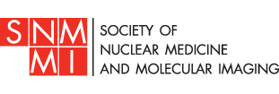
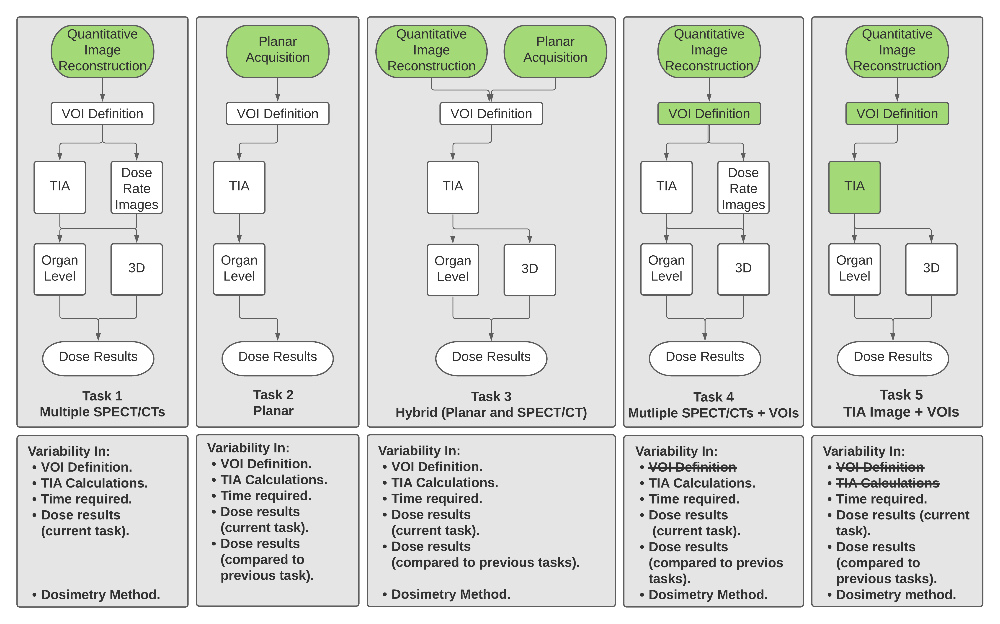

# SNMMI Dosimetry Challenge 2021 

Welcome to the repository for the analysis of the SNMMI dosimetry challenge.

Here we are trying to go deep into understanding the variability in the data submitted by the participants.

We are asking questions, and we are trying to put documents together to answer those questions as [linked below](#Questions).

# Tasks

1) Pure SPECT
2) Planar Dosimetry
3) Hybrid (Planar + 1 SPECT)
4) Pure SPECT with VOIs given to participants.
5) Pure SPECT with VOIs and TIA given to participants.

# Publications

* Uribe C, Peterson A, Van B, Fedrigo R, Carlson J, Sunderland J, Frey E, Dewaraja Y. An International Study of Factors Affecting Variability of Dosimetry Calculations, Part 1: Design and Early Results of the SNMMI Dosimetry Challenge. Journal of Nuclear Medicine Dec 2021, 62 (Supplement 3) 36S-47S; [DOI: 10.2967/jnumed.121.262748](https://jnm.snmjournals.org/content/62/Supplement_3/36S.long)

* 

# Questions

1) [What is the variability in absorbed doses between tasks?](./notebooks/Question1.ipynb) 

# Data
